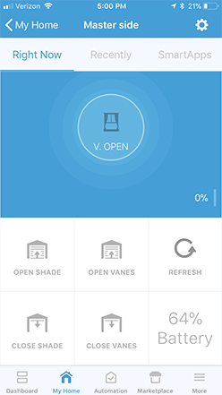
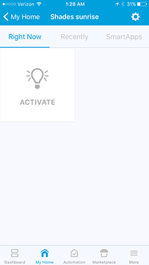
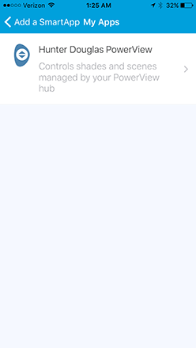
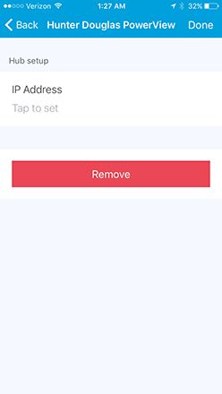
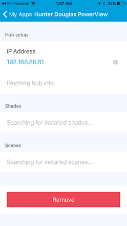
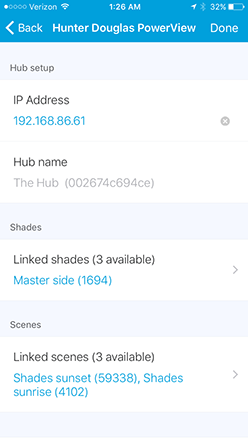
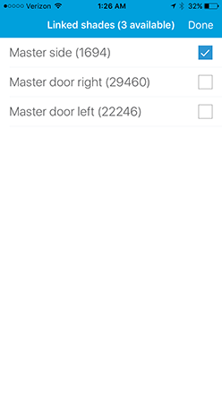
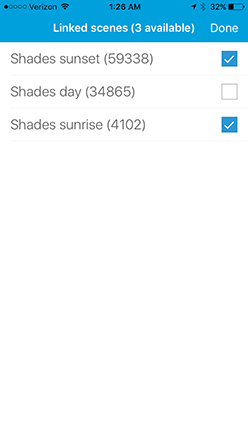

# Hunter Douglas PowerView Hub bridge for SmartThings

## Overview

This project implements a SmartApp and device handlers to allow you to directly communicate with the PowerView hub on your local network and do the following:
* auto-discover registered shades
* auto-discover configured scenes
* set/monitor the shade level
* set/monitor the vanes level
* monitor battery level
* execute scenes

The benefit of using this is that there is no requirement for the default PowerView Account web service or other middlemen like IFTTT--your SmartThings hub will communicate directly with the PowerView hub. **Note:** due to the way SmartThings works, a connection to the ST cloud is still required.

This project currently does *not* support:
* reading/editing rooms
* modifying schedules set in PV
* editing scenes
* reading/editing scene collections
* managing PowerView Connect settings

This is primarily for [Hunter Douglas Silhouette shades](https://www.hunterdouglas.com/silhouette) so there is both the vane and shade control. Other shades will likely work, though there will be extraneous functionality that may throw errors. Relying on scenes is likely the easiest way forward in this case.

## Screenshots
The shade control panel. Note that the primary action (top circle) is for toggling the vanes on and off. The brightness control is for the shade. The device handler should refresh its state every minute in the background. The "refresh" tile is there if you need to know the state immediately.

 

The scene control panel. This is implemented as a momentary switch and there is no state tracking info, i.e., the "Recently" tab will always be empty.



## Installation
This requires you to log in to the [SmartThings web-based IDE](https://graph.api.smartthings.com) to add a custom SmartApp and two custom device handlers.

1. Register the following custom components (see [tutorial for SmartApps](https://community.smartthings.com/t/faq-an-overview-of-using-custom-code-in-smartthings/16772) and [device handlers](https://www.thesmartesthouse.com/blogs/the-smartest-blog/how-to-install-a-custom-device-handler-in-smartthings)):
   1. Install the `Hunter Douglas PowerView` SmartApp from this repo: owner=`johnvey`, name=`smartthings-hd-powerview`, branch=`master`
   1. Install the `Hunter Douglas PowerView Shade` device handler from this repo
   1. Install the `Hunter Douglas PowerView Scene` device handler from this repo
1. Add the newly registered SmartApp via *Automation* > *SmartApps* > *Add a SmartApp* > *My Apps* section
1. Open the app

   
1. Enter the IP address of your PowerView hub, click "Done"
  
   
1. Wait for the app to discover your shades and scenes

    
1. Choose the shades you want to control via SmartThings

   
1. Choose the scenes you want to control via SmartThings

   

## Implementation Details

The PowerView hub is a very simple HTTP server. I've documented the API that I've been able to sniff from a hub at `Rev. 1, SubRev. 1, Build 847`:

[Hunter Douglas PowerView HTTP API](https://github.com/johnvey/smartthings-hd-powerview/blob/master/hunter_douglas_powerview_api.md)

The structure of this SmartThings handler is:
* 1 SmartApp that handles the initial setup and discovery of the connected shades and configured scenes
* 1 device handler instance for each shade
* 1 device handler instance for each scene

## SmartThings Programming Errata

Programming these handlers was markedly cumbersome due to the poor quality of the documentation. Here are some tips that I wish I knew before I had started:

### **Tip 1:** There are several incantations to have your ST hub communicate directly with a device on your LAN.

This is the most reliable method that I had found:
1. instantiate your own `HubAction()` instance
1. use the `HubAction(map requestConfig, string deviceID, map options)` signature
1. provide an explicit callback function if you need to parse the response
1. use a unique identifier for the device ID, *not* some kind of hash of the MAC address (the official docs cover this multiple times but the forums are rife with misinformation)

```
sendRequest(method, path, body=null, callbackFn=null) {
    def host = '192.168.1.123:4567'
    def contentType = 'application/json'
    def deviceId = '18d11666-14de-4a46-9492-86a147ef0e3b'
    def hubAction = new physicalgraph.device.HubAction(
        [
            method: method,
            path: path,
            HOST: host,
            headers: [
                'HOST': host, // yes, it is required here and above
                'Content-Type': contentType
            ],
            body: body
        ],
        deviceId,
        [
            callback: callbackFn
        ]
    )
    log.debug("sendRequest: ${method} ${host}${path}")
    return hubAction
}
```
Note that this implementation generally requires that you invoke this from a device event, i.e., if the ST framework was the caller that initiated this invocation somewhere up in your call tree. If you decide to invoke this via a timer, e.g. `runEvery1Minute()`, then you *must* invoke via the `sendHubCommand()` method. See [example](https://github.com/johnvey/smartthings-hd-powerview/blob/master/devicetypes/johnvey/hunter-douglas-powerview-shade.src/hunter-douglas-powerview-shade.groovy#L309).

### **Tip 2:** If you are connecting your GitHub project directly to the ST IDE, make sure your source code file name matches the `name` field in the metadata declaration exactly.
If you fail to do this, attempting to use the "Update from repo" functionality will fail with no further explanation. [Official doc mention](http://docs.smartthings.com/en/latest/tools-and-ide/github-integration.html#step-5-configure-git-to-sync-fork-with-smartthings).

### **Tip 3:** Direct embed of a `dynamicPage()` inside of the top-level `preferences()` block for a SmartApp doesn't work.
Instead of something like
```
preferences {
    dynamicPage(...)
}
```
use a separate function like:
```
preferences {
    page(name: "singlePagePref")
}
def singlePagePref() {
    return dynamicPage() {...}
}
```

### **Tip 4:** You can use many of the other Groovy language features.
You can use `import` to bring in other functionality that makes programming in ST more palatable. For example, I wanted to declare a top-scope "enum", but ran into the sandboxing that ST uses via a [class wrapper around your SmartApp](http://docs.smartthings.com/en/latest/getting-started/groovy-for-smartthings.html#how-it-works). The solution to this was to [use the `@Field` decorator](https://stackoverflow.com/questions/6305910/how-do-i-create-and-access-the-global-variables-in-groovy) to effectively hoist my `def`s out of the default scope.